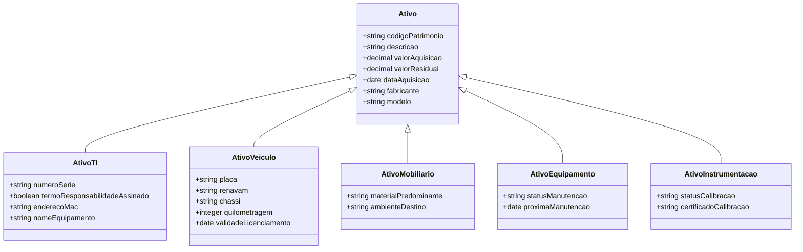
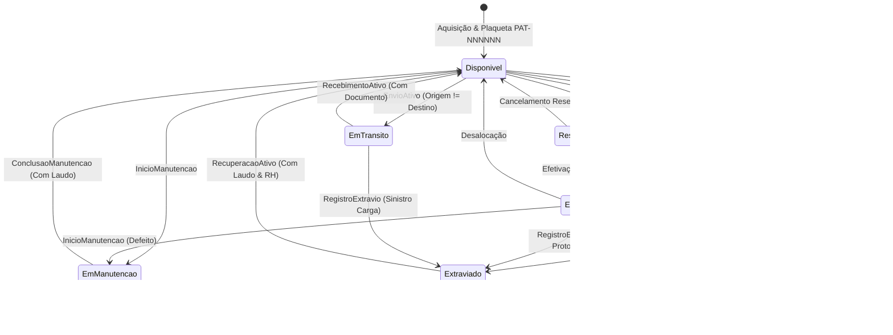
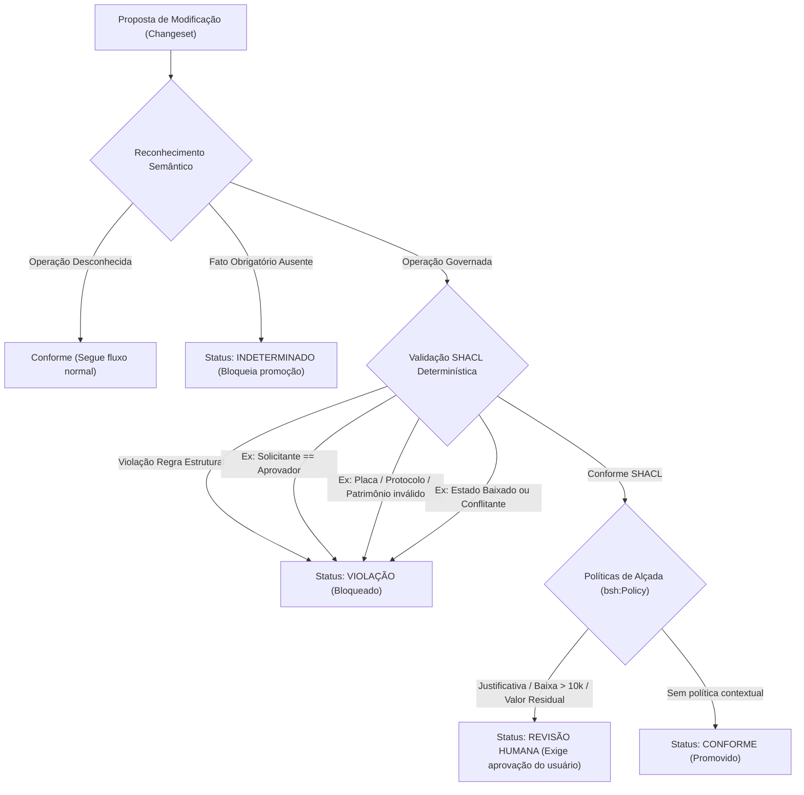
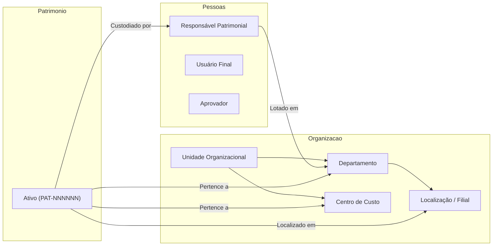

# Relatório Técnico: Evolução do Domínio de Ativos do Projeto Piloto

Este documento documenta a expansão da ontologia, restrições SHACL, políticas de governança e mapeamentos semânticos do domínio `ativos` no Business Semantic Harness (BSH).

---

## 1. Tabela de Conceitos

| Conceito | Tipo | Descrição | Relações Principais |
| :--- | :--- | :--- | :--- |
| **`ex:Ativo`** | `rdfs:Class` | Bem físico patrimonial identificado e administrado pelo projeto. | `temResponsavel`, `pertenceDepartamento`, `pertenceCentroDeCusto`, `temLocalizacao` |
| **`ex:AtivoTI`** | `rdfs:Class` | Subclasse de Ativo que representa equipamentos computacionais corporativos. | `rdfs:subClassOf ex:Ativo`, `termoResponsabilidadeAssinado`, `numeroSerie`, `enderecoMac` |
| **`ex:AtivoVeiculo`** | `rdfs:Class` | Subclasse de Ativo que representa veículos automotores da frota. | `rdfs:subClassOf ex:Ativo`, `placa`, `renavam`, `chassi`, `quilometragem` |
| **`ex:AtivoMobiliario`** | `rdfs:Class` | Subclasse de Ativo para mobiliário de escritório e estações de trabalho. | `rdfs:subClassOf ex:Ativo`, `materialPredominante`, `ambienteDestino` |
| **`ex:AtivoEquipamento`** | `rdfs:Class` | Subclasse de Ativo para maquinários e ferramentas sujeitos a manutenção periódica. | `rdfs:subClassOf ex:Ativo`, `statusManutencao`, `dataUltimaManutencao`, `dataProximaManutencao` |
| **`ex:AtivoInstrumentacao`** | `rdfs:Class` | Subclasse de Ativo para instrumentos de precisão sujeitos a calibração periódica. | `rdfs:subClassOf ex:Ativo`, `statusCalibracao`, `certificadoCalibracao`, `dataProximaCalibracao` |
| **`ex:Pessoa`** | `rdfs:Class` | Indivíduo integrante do quadro organizacional. | Base para `Responsavel`, `Usuario`, `Gestor`, `Aprovador` |
| **`ex:Responsavel`** | `rdfs:Class` | Custodiante legal ou responsável patrimonial direto por um bem. | `rdfs:subClassOf ex:Pessoa`, `lotadoEmDepartamento` |
| **`ex:Usuario`** | `rdfs:Class` | Usuário final a quem um ativo é disponibilizado para operação diária. | `rdfs:subClassOf ex:Pessoa` |
| **`ex:Gestor`** | `rdfs:Class` | Líder de departamento ou unidade organizacional com poder de solicitação. | `rdfs:subClassOf ex:Pessoa` |
| **`ex:Aprovador`** | `rdfs:Class` | Usuário investido de alçada formal para chancelar movimentações. | `rdfs:subClassOf ex:Pessoa` |
| **`ex:Organizacao`** | `rdfs:Class` | Entidade jurídica corporativa mantenedora do patrimônio. | Topo da hierarquia corporativa |
| **`ex:UnidadeOrganizacional`** | `rdfs:Class` | Unidade de negócio, divisão ou filial da empresa. | Agrupa departamentos e centros de custo |
| **`ex:Departamento`** | `rdfs:Class` | Setor funcional ou área técnica da organização. | `vinculadoAUnidade`, aloca responsáveis |
| **`ex:CentroDeCusto`** | `rdfs:Class` | Unidade contábil e orçamentária que absorve os custos e depreciação. | `vinculadoAUnidade` |
| **`ex:Filial`** | `rdfs:Class` | Instalação física ou sede operacional da organização. | Vincula localizações |
| **`ex:Localizacao`** | `rdfs:Class` | Ponto físico, sala, prédio ou depósito onde o bem reside. | Alvo de `temLocalizacao` |
| **`ex:AlcadaAprovacao`** | `rdfs:Class` | Instância colegiada ou executiva de deliberação patrimonial. | Base para Diretoria e Controladoria |
| **`ex:Diretoria`** | `rdfs:Class` | Diretoria executiva responsável por baixas de alto valor e alienações. | `rdfs:subClassOf ex:AlcadaAprovacao` |
| **`ex:Controladoria`** | `rdfs:Class` | Órgão regulador de conformidade contábil e depreciação patrimonial. | `rdfs:subClassOf ex:AlcadaAprovacao` |
| **`ex:Manutencao`** | `rdfs:Class` | Processo técnico de reparo ou preservação de equipamento. | Base para preventiva e corretiva |
| **`ex:ManutencaoPreventiva`** | `rdfs:Class` | Manutenção programada com base em tempo de uso ou periodicidade. | `rdfs:subClassOf ex:Manutencao` |
| **`ex:ManutencaoCorretiva`** | `rdfs:Class` | Manutenção emergencial para restauração de defeito apresentado. | `rdfs:subClassOf ex:Manutencao` |
| **`ex:PlanoManutencao`** | `rdfs:Class` | Calendário e parâmetros de engenharia para intervenções de manutenção. | Estipula periodicidade |
| **`ex:MovimentacaoAtivo`** | `rdfs:Class` | Evento de deslocamento logístico interestadual ou interdepartamental. | Referenciada em despachos |
| **`ex:DocumentoMovimentacao`** | `rdfs:Class` | Guia fiscal, termo de remessa ou documento formal de transporte. | Alvo de `movimentacaoReferenciada` |
| **`ex:EventoPatrimonial`** | `rdfs:Class` | Superclasse para todas as transações e mutações patrimoniais do sistema. | `registradoPor`, `dataHoraRegistro`, `correlationId` |
| **`ex:RegistroAuditoria`** | `rdfs:Class` | Metadados de conformidade e rastreabilidade temporal. | Carimbo de integridade |

---

## 2. Tabela de Estados do Ciclo de Vida

| Estado | Significado no Negócio | Operações Permitidas | Operações Proibidas |
| :--- | :--- | :--- | :--- |
| **`ex:Disponivel`** | Ativo em depósito ou almoxarifado, pronto para uso ou destinação. | `AlocacaoUsuario`, `ReservaAtivo`, `TransferenciaAtivo`, `EnvioAtivo`, `InicioManutencao`, `BaixaAtivo`, `RegistroExtravio` | `ConclusaoManutencao`, `RecebimentoAtivo`, `RecuperacaoAtivo` |
| **`ex:EmUso`** | Ativo alocado a um colaborador ou setor operacional ativo. | `TransferenciaAtivo`, `AlteracaoResponsavel`, `AtualizacaoLocalizacao`, `InicioManutencao`, `BaixaAtivo`, `RegistroExtravio` | `AlocacaoUsuario` (direta sem liberação), `ConclusaoManutencao`, `RecebimentoAtivo`, `RecuperacaoAtivo` |
| **`ex:EmManutencao`** | Ativo sob intervenção técnica ou reparo em bancada/oficina. | `ConclusaoManutencao`, `RegistroExtravio` | `AlocacaoUsuario`, `TransferenciaAtivo`, `ReservaAtivo`, `EnvioAtivo` (operacional), `BaixaAtivo` convencional |
| **`ex:EmTransito`** | Ativo despachado e em transporte físico entre unidades. | `RecebimentoAtivo`, `RegistroExtravio` | `TransferenciaAtivo` (re-envio), `AlocacaoUsuario`, `ReservaAtivo`, `InicioManutencao`, `BaixaAtivo` |
| **`ex:Reservado`** | Ativo comprometido para um projeto ou usuário em data futura. | `AlocacaoUsuario` (para o solicitante da reserva), `CancelamentoReserva` | `ReservaAtivo` concorrente, `TransferenciaAtivo` para terceiro, `EnvioAtivo` não planejado |
| **`ex:Extraviado`** | Ativo com paradeiro desconhecido e sinistro/BO aberto. | `RecuperacaoAtivo` | `TransferenciaAtivo`, `AlocacaoUsuario`, `ReservaAtivo`, `BaixaAtivo` convencional, `InicioManutencao` |
| **`ex:Baixado`** | Estado terminal; bem alienado, leiloado, doado ou sucateado. | Nenhuma (estado terminal estrito) | Todas as operações de mutação patrimonial |

---

## 3. Tabela de Operações Patrimoniais

| Operação | Fatos Necessários | Shapes Aplicáveis | Políticas Aplicáveis |
| :--- | :--- | :--- | :--- |
| **`TransferenciaAtivo`** | `estadoAtual`, `novoResponsavel`, `novaLocalizacao`, `solicitante`, `aprovador` | `ex:TransferenciaShape` | `ex:justificativa-adequada`, `ex:transferencia-inter-unidades` |
| **`BaixaAtivo`** | `estadoAtual`, `motivoBaixa`, `valorAquisicao`, `valorResidual`, `laudoTecnicoDescarte` | `ex:BaixaShape` | `ex:motivo-baixa-adequado`, `ex:baixa-alto-valor`, `ex:baixa-valor-residual`, `ex:aprovacao-diretoria-controladoria` |
| **`AlteracaoResponsavel`** | `estadoAtual`, `novoResponsavel` | `ex:ResponsavelShape` | - |
| **`AtualizacaoLocalizacao`** | `estadoAtual`, `novaLocalizacao` | `ex:LocalizacaoShape` | - |
| **`AlocacaoUsuario`** | `estadoAtual`, `novoResponsavel`, `termoResponsabilidadeAssinado` | `ex:AlocacaoUsuarioShape` | - |
| **`ReservaAtivo`** | `estadoAtual`, `solicitanteReserva`, `dataInicioReserva`, `dataFimReserva`, `motivoReserva` | `ex:ReservaAtivoShape` | - |
| **`InicioManutencao`** | `estadoAtual`, `motivoManutencao` | `ex:InicioManutencaoShape` | - |
| **`ConclusaoManutencao`** | `estadoAtual`, `laudoManutencao` | `ex:ConclusaoManutencaoShape` | - |
| **`EnvioAtivo`** | `estadoAtual`, `origem`, `destino`, `transportador` | `ex:EnvioAtivoShape` | - |
| **`RecebimentoAtivo`** | `estadoAtual`, `movimentacaoReferenciada` | `ex:RecebimentoAtivoShape` | - |
| **`RegistroExtravio`** | `estadoAtual`, `protocoloSinistro` | `ex:RegistroExtravioShape` | - |
| **`RecuperacaoAtivo`** | `estadoAtual`, `laudoRecuperacao` | `ex:RecuperacaoAtivoShape` | `ex:recuperacao-extraviado` |

---

## 4. Tabela de Shapes SHACL

| Shape | `targetClass` | Restrição Central | Mensagem de Violação | Tipo de Falha |
| :--- | :--- | :--- | :--- | :--- |
| **`TransferenciaShape`** | `TransferenciaAtivo` | `estadoAtual in (Disponivel, EmUso)` | *"Ativo baixado não pode ser transferido."* | Estado terminal inválido |
| | | `novoResponsavel minCount 1` | *"A transferência exige responsável."* | Cardinalidade obrigatória |
| | | `novaLocalizacao minCount 1` | *"A transferência exige nova localização."* | Cardinalidade obrigatória |
| | | `solicitante disjoint aprovador` | *"O solicitante da transferência não pode ser o aprovador da movimentação."* | Segregação de Funções (SoD) |
| **`BaixaShape`** | `BaixaAtivo` | `estadoAtual in (Disponivel, EmUso)` | *"Ativo baixado não pode sofrer nova baixa."* | Transição terminal inválida |
| | | `motivoBaixa minCount 1` | *"A baixa exige motivo."* | Cardinalidade obrigatória |
| **`ResponsavelShape`** | `AlteracaoResponsavel` | `estadoAtual in (Disponivel, EmUso)` | *"Ativo baixado não pode trocar de responsável."* | Estado terminal inválido |
| | | `novoResponsavel minCount 1` | *"A alteração exige novo responsável."* | Cardinalidade obrigatória |
| **`LocalizacaoShape`** | `AtualizacaoLocalizacao` | `estadoAtual in (Disponivel, EmUso)` | *"Ativo baixado não pode mudar de localização."* | Estado terminal inválido |
| | | `novaLocalizacao minCount 1` | *"A alteração exige nova localização."* | Cardinalidade obrigatória |
| **`IdentificacaoPatrimonialShape`** | `Ativo` | `codigoPatrimonio pattern ^PAT-[0-9]{6}$` | *"O código patrimonial é obrigatório e deve obedecer ao padrão PAT-NNNNNN (ex: PAT-000123)."* | Regex e Formato estrito |
| **`AtivoTIShape`** | `AtivoTI` | `numeroSerie minCount 1 (string)` | *"Ativo de TI exige número de série de fábrica."* | Identificação serial |
| **`AtivoVeiculoShape`** | `AtivoVeiculo` | `placa pattern ^[A-Z]{3}[0-9][A-Z0-9][0-9]{2}$` | *"Veículo exige placa no padrão oficial (Mercosul ou tradicional)."* | Regex de placa |
| | | `renavam pattern ^[0-9]{9,11}$` | *"Veículo exige RENAVAM válido (9 a 11 dígitos numéricos)."* | Regex RENAVAM |
| | | `chassi pattern ^[A-HJ-NPR-Z0-9]{17}$` | *"Veículo exige chassi VIN com exatamente 17 caracteres alfanuméricos válidos."* | Regex Chassi VIN |
| **`AlocacaoUsuarioShape`** | `AlocacaoUsuario` | `estadoAtual in (Disponivel, Reservado)` | *"Ativo em manutenção, baixado ou extraviado não pode ser alocado a usuário final."* | Incompatibilidade de estado |
| | | `termoResponsabilidadeAssinado hasValue true` | *"Alocação a usuário exige termo de responsabilidade assinado."* | Conformidade legal |
| **`ReservaAtivoShape`** | `ReservaAtivo` | `estadoAtual in (Disponivel)` | *"Apenas ativo disponível pode ser reservado."* | Incompatibilidade de estado |
| | | `dataInicioReserva, dataFimReserva datatype xsd:date` | *"A reserva exige data de início e término válidas (xsd:date)."* | Tipagem temporal |
| **`InicioManutencaoShape`** | `InicioManutencao` | `estadoAtual in (Disponivel, EmUso)` | *"Apenas ativo disponível ou em uso pode entrar em manutenção."* | Incompatibilidade de estado |
| **`ConclusaoManutencaoShape`** | `ConclusaoManutencao` | `estadoAtual in (EmManutencao)` | *"Conclusão de manutenção somente pode ocorrer para ativo em manutenção."* | Transição de estado |
| | | `laudoManutencao minCount 1` | *"Conclusão de manutenção exige laudo técnico."* | Evidência técnica |
| **`EnvioAtivoShape`** | `EnvioAtivo` | `origem disjoint destino` | *"O envio de ativo exige localização de origem distinta da localização de destino."* | Consistência física |
| | | `transportador minCount 1` | *"O envio de ativo exige identificação do transportador."* | Rastreabilidade |
| **`RecebimentoAtivoShape`** | `RecebimentoAtivo` | `estadoAtual in (EmTransito)` | *"Recebimento somente pode ocorrer para ativo em trânsito."* | Transição de estado |
| | | `movimentacaoReferenciada minCount 1` | *"O recebimento exige referência ao documento de movimentação anterior."* | Vínculo documental |
| **`RegistroExtravioShape`** | `RegistroExtravio` | `protocoloSinistro pattern ^SIN-[0-9]{4}/[0-9]{6}$` | *"Registro de extravio exige protocolo de sinistro no formato SIN-AAAA/NNNNNN."* | Regex protocolo |
| **`RecuperacaoAtivoShape`** | `RecuperacaoAtivo` | `estadoAtual in (Extraviado)` | *"A recuperação somente pode ser aplicada a ativo em estado Extraviado."* | Transição restrita |
| | | `laudoRecuperacao minCount 1` | *"A recuperação de ativo extraviado exige laudo de vistoria e recuperação."* | Evidência técnica |
| **`ConformidadeManutencaoShape`** | `AtivoEquipamento` | `statusManutencao in (EmDia, Isento)` | *"Ativo com manutenção periódica vencida não pode ser enviado para operação."* | Compliance preventivo |
| **`ConformidadeCalibracaoShape`** | `AtivoInstrumentacao` | `statusCalibracao in (CalibracaoEmDia, CalibracaoIsenta)` | *"Equipamento com calibração vencida não pode ser alocado para uso operacional."* | Conformidade metrológica |
| **`AuditoriaShape`** | `EventoPatrimonial` | `registradoPor minCount 1` | *"A auditoria exige a identificação do usuário que registrou a operação."* | Rastreabilidade autoral |
| | | `dataHoraRegistro datatype xsd:dateTime` | *"A auditoria exige data e hora de registro válida (xsd:dateTime)."* | Timestamp ISO auditável |

---

## 5. Tabela de Políticas de Alçada Humana (`bsh:Policy`)

| Política | Operação Governada | Requer Revisão Humana? | Motivo da Política |
| :--- | :--- | :--- | :--- |
| **`ex:justificativa-adequada`** | `ex:TransferenciaAtivo` | `true` | A pertinência de remanejar um bem entre projetos ou unidades depende de julgamento contextual de conveniência administrativa. |
| **`ex:motivo-baixa-adequado`** | `ex:BaixaAtivo` | `true` | A destruição ou descarte de patrimônio corporativo requer auditoria contextual para evitar fraudes ou descarte indevido. |
| **`ex:baixa-alto-valor`** | `ex:BaixaAtivo` | `true` | Descarte ou alienação de bens com custo de aquisição superior a R$ 10.000 exige deliberação formal de Diretoria Executiva ou Controladoria. |
| **`ex:baixa-valor-residual`** | `ex:BaixaAtivo` | `true` | Baixa de bem contabilisticamente ativo (valor residual > 0) acarreta prejuízo fiscal e exige emissão de parecer contábil prévio. |
| **`ex:recuperacao-extraviado`** | `ex:RecuperacaoAtivo` | `true` | Reintegração de bem extraviado exige validação pericial e cancelamento formal da apólice de sinistro corporativa. |
| **`ex:transferencia-inter-unidades`** | `ex:TransferenciaAtivo` | `true` | Transferências que cruzam unidades orçamentárias ou centros de custo exigem anuência mútua dos gestores de ambas as unidades. |
| **`ex:aprovacao-diretoria-controladoria`** | `ex:BaixaAtivo` | `true` | Decisões patrimoniais de caráter estratégico que impactam as metas financeiras da diretoria corporativa. |

---

## 6. Matriz de Cobertura (Operação × Estado)

| Operação \ Estado | `Disponivel` | `EmUso` | `EmManutencao` | `EmTransito` | `Reservado` | `Extraviado` | `Baixado` |
| :--- | :---: | :---: | :---: | :---: | :---: | :---: | :---: |
| **`TransferenciaAtivo`** | Permitida (RH) | Permitida (RH) | Proibida | Proibida | Proibida | Proibida | Proibida |
| **`BaixaAtivo`** | Permitida (RH) | Permitida (RH) | Proibida | Proibida | Proibida | Proibida | Proibida |
| **`AlteracaoResponsavel`** | Permitida | Permitida | Proibida | Proibida | Proibida | Proibida | Proibida |
| **`AtualizacaoLocalizacao`** | Permitida | Permitida | Proibida | Proibida | Proibida | Proibida | Proibida |
| **`AlocacaoUsuario`** | Permitida | Proibida | Proibida | Proibida | Permitida | Proibida | Proibida |
| **`ReservaAtivo`** | Permitida | Proibida | Proibida | Proibida | Proibida | Proibida | Proibida |
| **`InicioManutencao`** | Permitida | Permitida | Proibida | Proibida | Proibida | Proibida | Proibida |
| **`ConclusaoManutencao`** | Proibida | Proibida | Permitida | Proibida | Proibida | Proibida | Proibida |
| **`EnvioAtivo`** | Permitida | Permitida | Proibida | Proibida | Proibida | Proibida | Proibida |
| **`RecebimentoAtivo`** | Proibida | Proibida | Proibida | Permitida | Proibida | Proibida | Proibida |
| **`RegistroExtravio`** | Permitida | Permitida | Permitida | Permitida | Permitida | Proibida | Proibida |
| **`RecuperacaoAtivo`** | Proibida | Proibida | Proibida | Proibida | Proibida | Permitida (RH) | Proibida |

*Legenda*:
- **Permitida**: Transição permitida e validada deterministicamente via SHACL Core.
- **Permitida (RH)**: Transição estruturalmente permitida, porém interceptada por política `bsh:Policy` para Revisão Humana de alçada.
- **Proibida**: Transição rejeitada categoricamente com falha de conformidade SHACL (`conforms: false`).

---

## 7. Representações Visuais Reproduzíveis

### Figura 1: Visão Geral da Ontologia e Categorização de Ativos

### Figura 2: Máquina de Estados Finita e Ciclo de Vida do Ativo

### Figura 3: Governança Semântica, Alçada e Segregação de Funções

### Figura 4: Estrutura Organizacional e Custódia

---

## 8. Adoção de `shacl-engine` e Suporte Completo a SHACL-SPARQL com Comunica

Para superar as limitações do SHACL Core sem introduzir dependências externas pesadas ou runtimes heterogêneos (como Python), o BSH adotou a biblioteca `shacl-engine` (`^1.1.2`), mantendo toda a stack em TypeScript/Node.js nativo.

Internamente, o `shacl-engine` utiliza o motor SPARQL Comunica (`@comunica/query-sparql-rdfjs-lite`) para avaliar restrições `sh:sparql` sobre grafos RDF/JS (`n3`). Com essa arquitetura:

1. **Compatibilidade Organizacional na Transferência**:
   - Implementado no shape `ex:TransferenciaCompatibilidadeOrganizacionalShape`.
   - Consulta SPARQL valida que o `novoResponsavel` esteja ativamente lotado no `departamentoDestino` (`?responsavel ex:lotadoEmDepartamento ?deptoDestino`). Caso contrário, emite violação SHACL determinística.
2. **Exigência de Laudo para Baixa com Valor Residual**:
   - Implementado no shape `ex:BaixaValorResidualShape`.
   - Consulta SPARQL valida se `ex:valorResidual > 0`, exigindo a presença obrigatória de `ex:laudoTecnicoDescarte`.
3. **Desempenho e Qualidade**:
   - Execução local in-process em ~30ms por verificação sem overhead de serialização externa.
   - Suíte de 159 testes unitários/integração e 42 testes E2E aprovados com 100% de sucesso.

